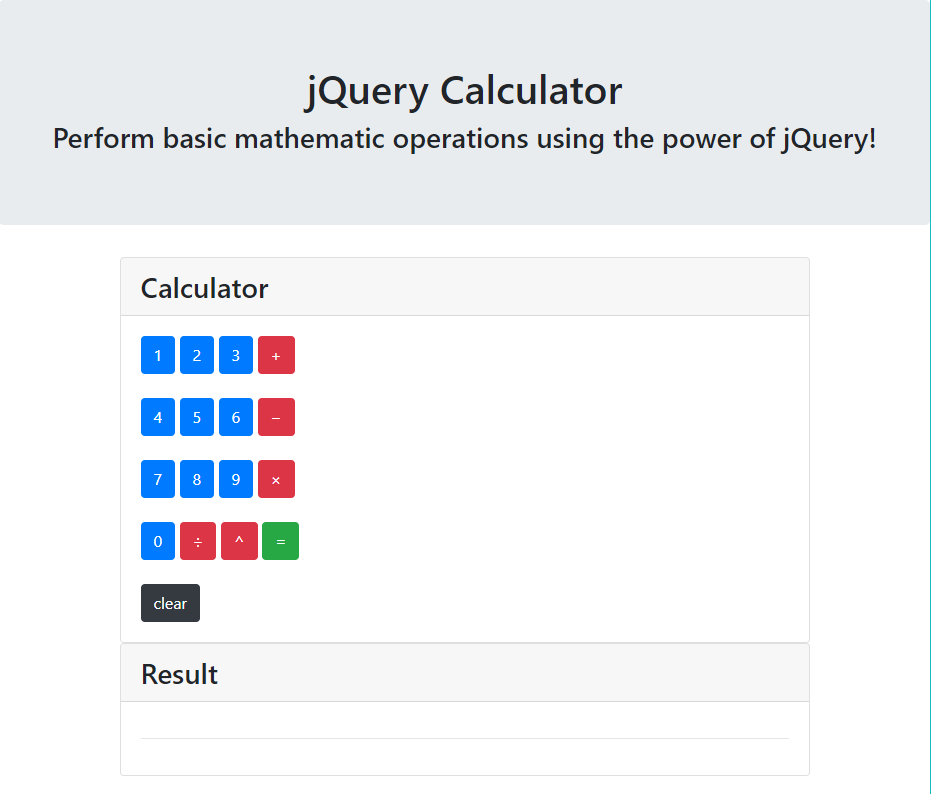
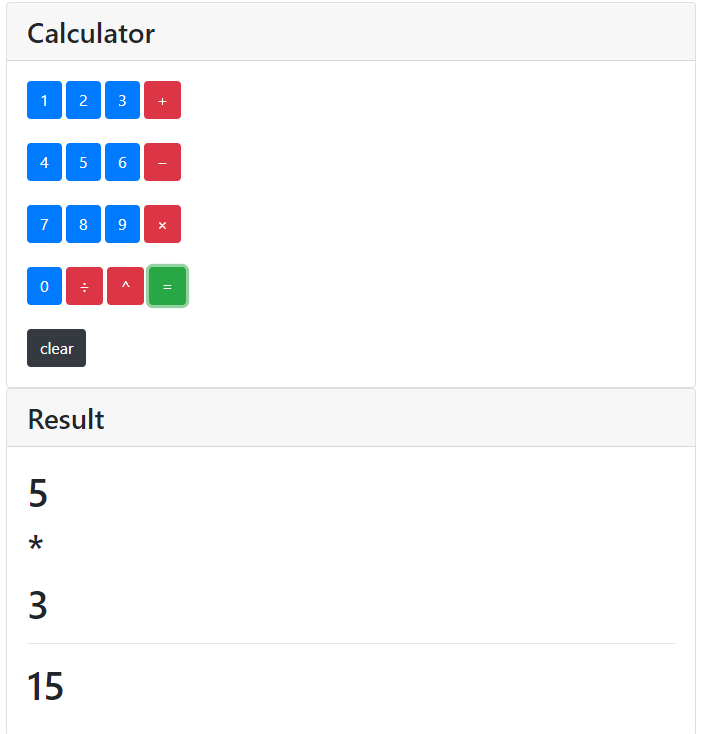
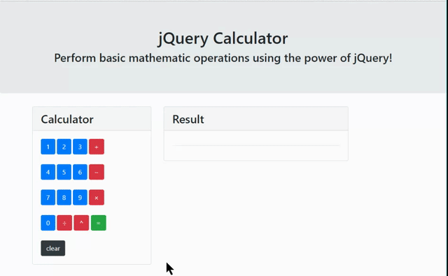

# jQuery Calculator
## Fully Functional jQuery Calculator

> This repo includes HTML & jQuery in order to create a fully functional calculator application. 

```
    - Front-end was created using BootStrap4
    - The UI was created using jQuery
    - .ready, .click, & .text functions
    - let variables && Switch Case 
```

***Home Page***

> Calculator Cleared



> Calculator multiplying




- - - 

***figure one***




## LINKS

- [jQuery Calculator Link](https://nicholasd-uci.github.io/jQueryCalculator/)
- [GitHub Repo Link](https://github.com/nicholasd-uci/jQueryCalculator)
- [Nicholas Dallas GitHub](https://github.com/nicholasd-uci)

- - -
© 2020 NPRD, Nicholas Paul Ruiz Dallas